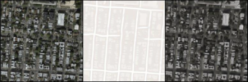
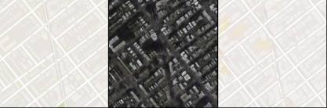
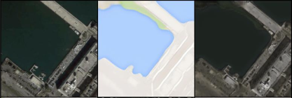
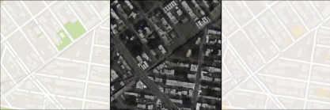
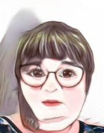
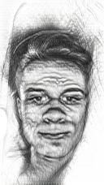
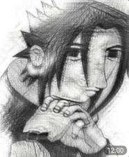
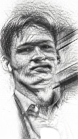
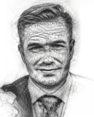
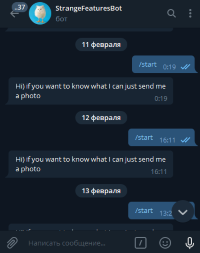

# **Bot with CycleGan**

### _Цель_
Разобрать и изучить архитектуру CycleGan

### _Задачи_:
- Изучить структуру CycleGan
- Решить существующую задачу
- Придумать свою задачу и осуществить её решение
- Сделать интерфейс для визуализации

### _Сбор данных_
Все данные я брал из отрытых источников - kaggle, google
В дальнейшем приходилось отбирать данные подходящие для моей задачи

### _Повтор существующей задачи_ 
В качестве уже решенной задачи я выбрал преобразования изображения со спутника в карты

### _Моя задача_
Для своей задачи я решил преобразовывать изображения в мультяшный стиль.
Сначала решил взять стиль мультфильма **Рик и Морти**, но из этого ничего не вышло

  
_(самое адекватное, что получилось)_

Теперь я решил искать что-то попроще и нашел более подходящую подборку картинок с мультяшным стилем,
он был рассчитан только на девушек, поэтому получается странно порой, но прикольно .

   

Вдобавок я пытался сделать стиль рисунка карандашом, вот что получалось:

   

_(Но на виртуальной машине почему-то получается хуже)_

### _Интерфейс_ 
В качестве интерфейса своей программы я решил использовать телеграм бота - удобно, быстро, легко

### _Создание бота и размещение_
Для создания бота я использовал библиотеку pyTelegramBotApi 

 Разместил его на virtual machine AWS EC2

# [**Бот**](https://t.me/StrangeFeaturesBot) 
_@StrangeFeaturesBot_

 
